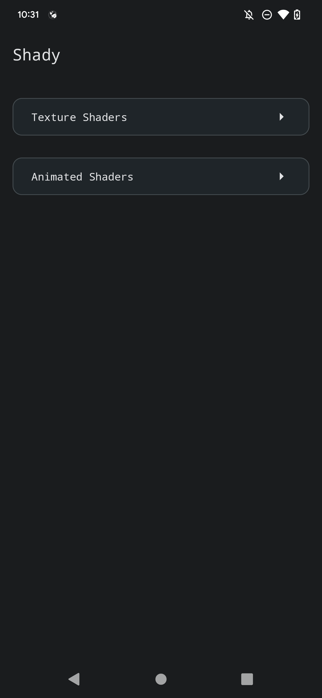
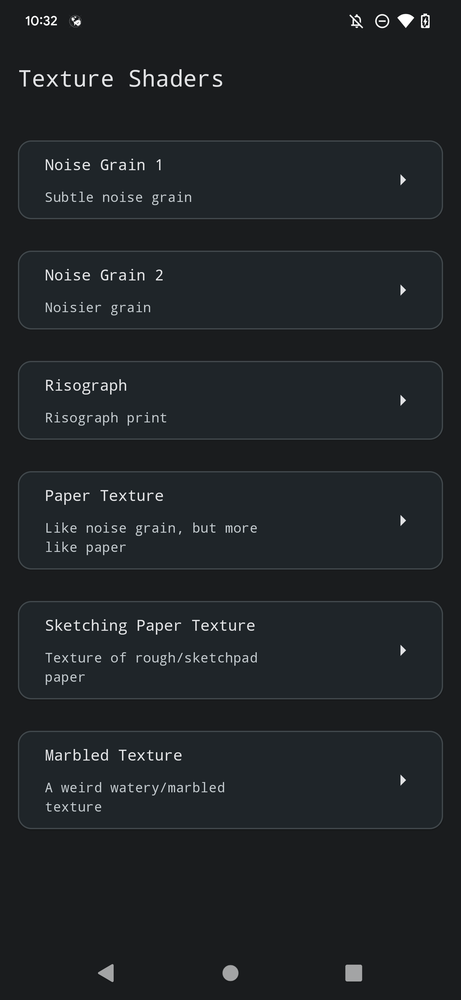
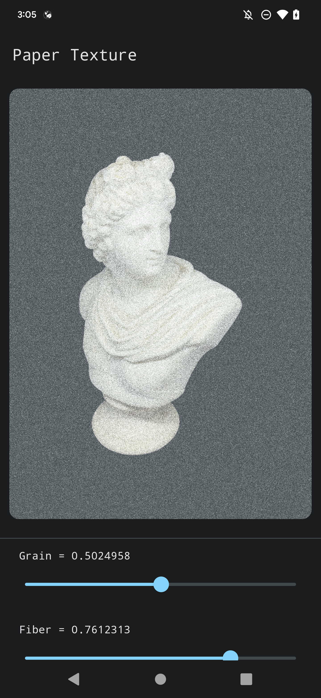

# 🕶 Shady


Shady is a gallery of [AGSL](https://developer.android.com/develop/ui/views/graphics/agsl) shaders showcasing runtime shader effects in Jetpack Compose, image texturing with shaders, and customizable/animated shader capabilities.

These shaders range from entertaining to practical, suitable for standalone effects or as a foundation for generative art and visualizations. Some shaders are ported from Shadertoy or adapted from GLSL, while others originated in SkSL and were slightly modified for AGSL.

 |  | 
|-|-|-|

## Getting Started

- Prerequisite: Android 13 (API 33) device
- Clone and build the project
- Explore the shaders and experiment with them in your own projects!

## `RuntimeShader`s

Pre-Android 13 devices can use pre-built shaders like `BitmapShader` or `LinearGradient`, while Android 13 and above can use programmable `RuntimeShader`s written in AGSL. These allow you to create GPU level effects without the need for direct OpenGL programming.

You can declare the shader as a string and benefit from basic syntax highlighting in the IDE by annotating the field with `@Language(value = "AGSL")`:

```glsl
@Language(value = "AGSL")
val shader = """
  uniform float2 resolution; // Viewport resolution (px)
  uniform float time; // Shader playback time (s)
  
  vec4 main(vec2 fragCoord) {
      // Normalized pixel coordinates (from 0 to 1)
      vec2 uv = fragCoord/resolution.xy;

      // Time varying pixel color
      vec3 col = 0.8 + 0.2 * cos(time*2.0+uv.xxx*2.0+vec3(1,2,4));

      // Output to screen
      return vec4(col,1.0);
  }
"""
```

To create the `RuntimeShader`, simply pass the `shader` into `RuntimeShader`'s constructor:

```kotlin
val runtimeShader = RuntimeShader(shader)
```

Alternatively, pass the string directly into `RuntimeShader`:

```glsl
val runtimeShader = RuntimeShader("""
  uniform float2 iResolution; // Viewport resolution (px)
  uniform float iTime; // Shader playback time (s)

  vec4 main(float2 fragCoord) {
      // Normalized pixel coordinates (from 0 to 1)
      vec2 uv = fragCoord/iResolution.xy;

      // Time varying pixel color
      vec3 col = 0.8 + 0.2*cos(iTime*2.0+uv.xxx*2.0+vec3(1,2,4));

      // Output to screen
      return vec4(col,1.0);
  }
"""
)
```

In this case IDE highlighting for the shader code remains intact because the constructor internally specifies `@Language(value = "AGSL")`.

## Uniforms

In the world of shaders, uniforms are global variables that act like bridges between the CPU and GPU. They're used to pass data to the GPU during rendering and are called "uniform" because they have a consistent value across all shader invocations in a single rendering call. Essentially, uniforms are like read-only data that all GPU threads can access but can't change.

You can use uniforms to control various aspects of the shader, such as time, color, and other variables. Set a uniform by using any of the `RuntimeShader#set***Uniform()` functions. The uniform name you provide should exactly match the name in the shader string. For instance, if you name the uniform `foo`, use the same name in `setFloatUniform()`:

```glsl
val runtimeShader = RuntimeShader("""
  uniform float foo;

  vec4 main(vec2 fragcoord) { 
      float value = 0.5 * foo;
      return vec4(value, value, value, 1.0);
  }
"""
)
```

```kotlin
runtimeShader.setFloatUniform(
  "foo",
  1.3f
)
```

In SkSL,(as seen on [shaders.skia.org](https://shaders.skia.org/)), some uniforms have standard or conventional names and are often prefixed with `i`:

AGSL/SkSL | Description
| -- | -- |
`float2 resolution` / `float3 iResolution` | represents the viewport resolution in pixels
`float time` / `float iTime` |  represents the elapsed time in seconds
`shader image` / `shader iImage` | represents an input image in the form of a shader

### Setting Resolution

The resolution uniform in shaders represents the dimensions (width and height) of the rendering surface or viewport in pixels. It is used to ensure that the shader adapts correctly to different resolutions by maintaining proper scaling and aspect ratio handling.

You could use the Composable's size to set the resolution of the shader according to the width and height:

```glsl
val runtimeShader = RuntimeShader("""
  uniform float2 resolution;

  vec4 main(vec2 fragcoord) { 
      return ...;
  }
"""
)
```

```kotlin
Modifier.onSizeChanged { size ->
  runtimeShader.setFloatUniform(
      "resolution",
      size.width.toFloat(),
      size.height.toFloat()
  )
}
```

### Animating Shaders

To create animated shaders, you need to incorporate a time variable. Shady offers several animated shaders that you can use or modify to create your custom animations. In order to animate a shader, a constantly varying time variable should be provided. One way to do this in Compose is using `produceState()`:

```kotlin
@Composable
fun produceDrawLoopCounter(speed: Float = 1f): State<Float> {
    return produceState(0f) {
        val firstFrame: Long = withFrameMillis { it }
        while (true) {
            withInfiniteAnimationFrameMillis {
                value = (it - firstFrame) * speed / 1000f
            }
        }
    }
}
```

Alternatively, you can use an `AnimationState` and an `animateTo(...)` function, where different `AnimationSpec`s can be applied to vary the time in different ways. This approach allows you to customize the animation further and create more complex effects.

### Custom Uniforms

Anything in a shader can be customized at runtime by introducing custom uniforms. For instance, in the `PaperTexture` shader, you might want the ability to adjust certain parameters, such as the grain intensity or the size of the paper fibers. To do so you'd turn these adjustable parts into uniforms like `grainIntensity` and `fiberIntensity`. Then, `MutableState`s can be used to set their values on the shader and manipulate them using UI elements like sliders:

```glsl
val PaperTexture = RuntimeShader("""
    ...
    uniform float grainIntensity;
    uniform float fiberIntensity;

    vec4 main(vec2 fragCoord)  {
      return ...
    }
"""
)
```

```kotlin
// Define states
var grain by remember { mutableStateOf(0.05f) }
var fiber by remember { mutableStateOf(0.5f) }

// Set states as uniforms on RuntimeShader
PaperTexture.setFloatUniform("grainIntensity", grain)
PaperTexture.setFloatUniform("fiberIntensity", fiber)

// Vary the values with sliders
Slider(
  value = grain,
  onValueChange = { grain = it },
)
Slider(
  value = fiber,
  onValueChange = { fiber = it },
)
```

## Using `RuntimeShader`s

Once you have your shader defined, the following sections showcase two different ways that you can use it in your Composables: as a `Modifier.renderEffect()` or as a `Brush`.

### As `RenderEffect`s

A `RenderEffect` adds a visual effect to a Composable by using its drawing commands along with the related effect. To create a `RenderEffect`, use the `RuntimeShader#createRuntimeShaderEffect()` function. This function runs a given shader and uses the `RenderNode`'s content as input. A `RenderNode` holds the drawing commands and properties of a Composable. When you apply a `RenderEffect` to a Composable, the shader receives the `RenderNode` as input and adds the visual effect to the Composable.

To apply a `RenderEffect` using a `RuntimeShader`, you'll need to specify the shader and the uniform name (see more about uniforms [here](#providing-uniforms-to-shaders)) used to bind the `RenderNode` contents to the input. You can configure a `RenderEffect` on a `GraphicsLayerScope` and it will be applied when the Composable is drawn. Use `Modifier.graphicsLayer` (to access the `GraphicsLayerScope`) on the Composable you want to apply a `RenderEffect`. In the snippet below, the `RenderEffect` is created using `SketchingPaperTexture` as the `RuntimeShader`, and `"image"` as the name of the uniform for the `RenderNode` content:

```kotlin
Modifier.graphicsLayer {
    renderEffect = RenderEffect.createRuntimeShaderEffect(
        SketchingPaperTexture, // The RuntimeShader
        "image" // The name of the uniform for the RenderNode content
    ).asComposeRenderEffect()
}
```

In the AGSL shader, you'd then declare a `uniform shader image`, where "image" maps the input you have to `RenderEffect.createRuntimeShaderEffect()`. This declaration treats the contents of your Composable as another incoming shader. Both AGSL and Skia use the [`.eval()` method](https://skia.org/docs/user/sksl/#evaluating-sampling-other-skshaders) to evaluate other shaders.

In the example below, the "image" uniform is used to sample the incoming image and swap the red and blue channels:

```glsl
 // What gets passed into createRuntimeShaderEffect()
uniform shader image;

half4 main(float2 coord) {
  // Sample 'image', then swap red and blue
  return image.eval(coord).bgra;
}
```

### As `Brush`es

Shaders can be utilized as `Brush`es, letting you draw with added visual effects. To use a shader as a `Brush`, create a `ShaderBrush` using your `RuntimeShader`. This `ShaderBrush` essentially takes the given shader and applies it to a `Paint` object, enabling the visual effect.

Once you have a `ShaderBrush`, you can use it when drawing anything in a `DrawScope`:

```kotlin
val GradientShader = RuntimeShader(/* ... */)
val brush = ShaderBrush(GradientShader)

Canvas { /** this: DrawScope **/
  drawRect(brush)
}
```

## Contributing

Contributions are welcome and encouraged! If you have an AGSL shader that you'd like to share, please submit a pull request from your fork. Your shader can then be added to the collection, giving other developers the opportunity to learn from and use your work. Feel free to also provide suggestions and ideas for anything else in this repo!

## References

- [Shadertoy](https://www.shadertoy.com/)
- [shaders.skia.org](https://shaders.skia.org/) - best place to debug SkSL shaders
- [The Book of Shaders](https://thebookofshaders.com/) - best resource to learn about shaders
- Awesome articles detailing `RenderEffect`s in [Jetpack Compose](https://medium.com/androiddevelopers/making-jellyfish-move-in-compose-animating-imagevectors-and-applying-agsl-rendereffects-3666596a8888) and [Compose Desktop](https://www.pushing-pixels.org/2022/04/09/shader-based-render-effects-in-compose-desktop-with-skia.html)

## Licenses

This repository is licensed under the [MIT](/LICENSE) License. Some shaders were ported from Shadertoy and are licensed under (https://creativecommons.org/licenses/by-nc-sa/3.0/legalcode). Please comply with the CC BY-NC-SA license conditions when using or modifying these shaders.
